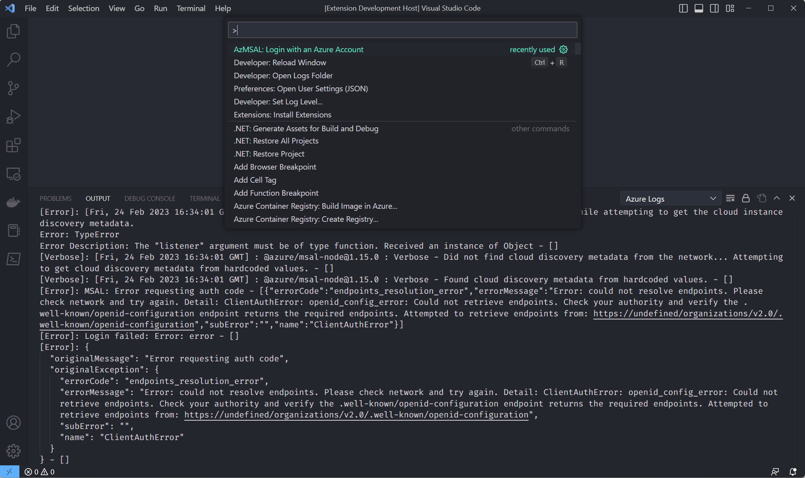

# Azure Auth with MSAL

VSCode Extension to test Azure Auth with MSAL

## Steps to reproduce:

- Clone the repository
- Open folder in VS Code
- Open terminal and execute below commands:
    ```
    yarn
    yarn run watch
    ```
- `F5` to run extension
- When a new window opens with extension loaded, open Command Palette (Ctrl + Shift + P) and run below command:
    ```
    "command": "azurewithmsal.azureLogin",
    "title": "AzMSAL: Login with an Azure Account"
    ```
- Open 'Azure Logs' from Output pane dropdown
- Running this command will reproduce issue: [msaljs#4879](https://github.com/AzureAD/microsoft-authentication-library-for-js/issues/4879)
- Notice the errors, as in screenshot below:

   

## Resolution

To resolve the error, upgrade the below dependencies in package.json and run `yarn`:

- "http-proxy-agent": "^5.0.0"
- "https-proxy-agent": "^5.0.0"

## UPDATE

**Issue is resolved with latest MSAL v1.16.0 with it's default HttpClient implementation.**